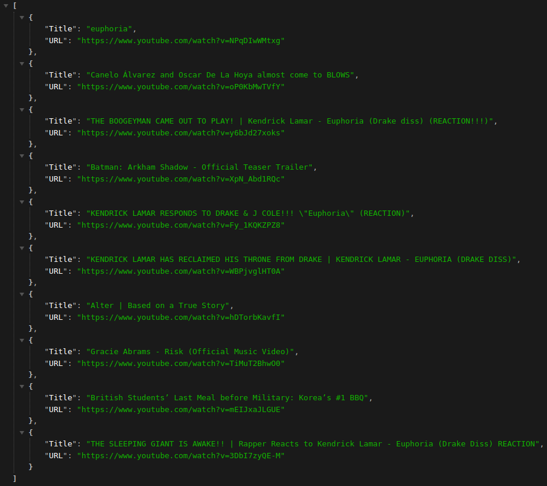
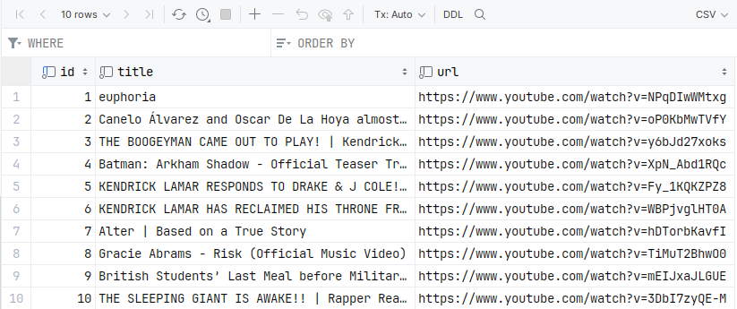

The endpoint that gives away the 10 most popular videos on YouTube!

This repository can be used as a template for creating endpoints!

## Start

1) Go to the folder "Docker"
2) Create Data Source (for example `"db-point"`)
3) Run `docker compose up`
4) Run script for create table in your database

- Method `FetchDataBlock` will take data from the table
- Method `SaveDataBlock` will save data to a table

```
create table youtube
(
    id    int auto_increment,
    title varchar(255) not null,
    url   varchar(255) not null,
    constraint youtube_pk
        unique (id)
);
```

5) When starting `main.go` specify a flag `--config-file ./config.yaml`

```shell
go run cmd/endpoint/main.go --config-file config.yaml
```

## For Get YouTube API Key

```
https://only-to-top.ru/blog/programming/2022-06-17-youtube-api-key.html
```

After receiving the key, do not forget to specify it in the configuration

## Example 



## Save in DataBase

